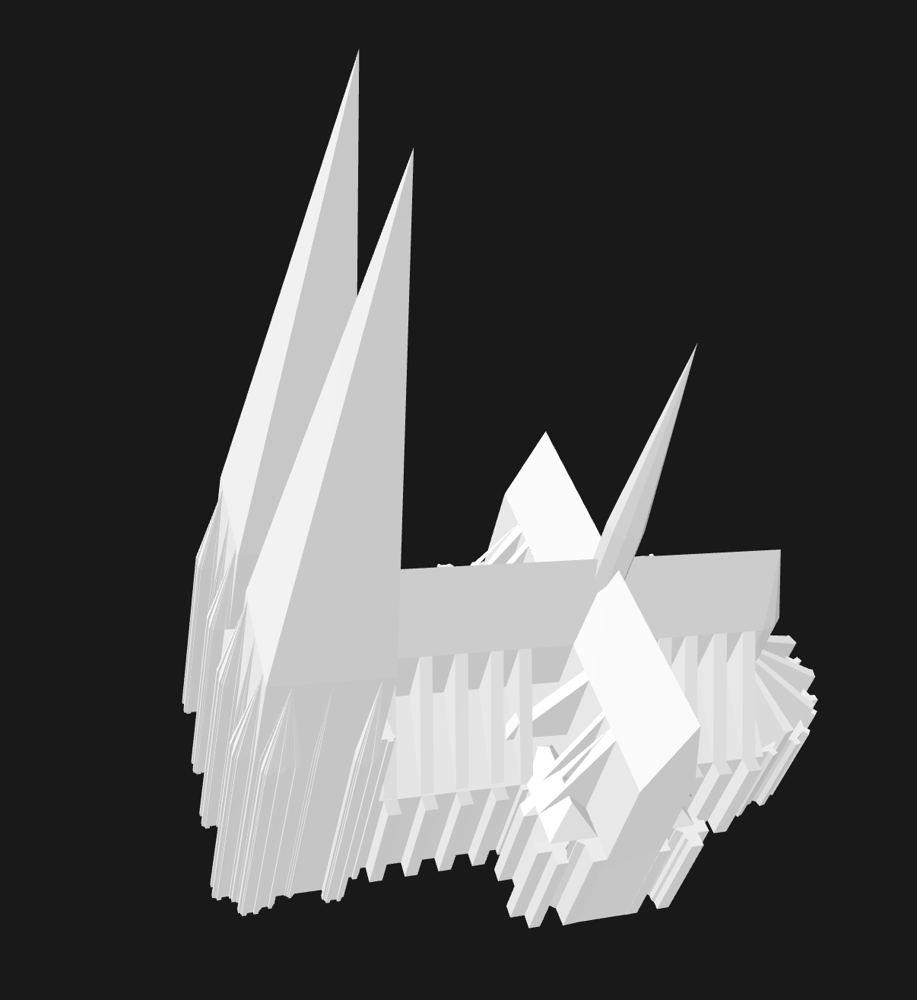
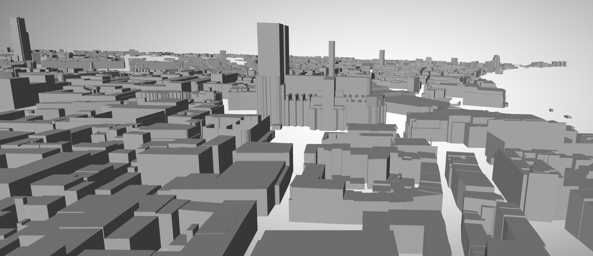
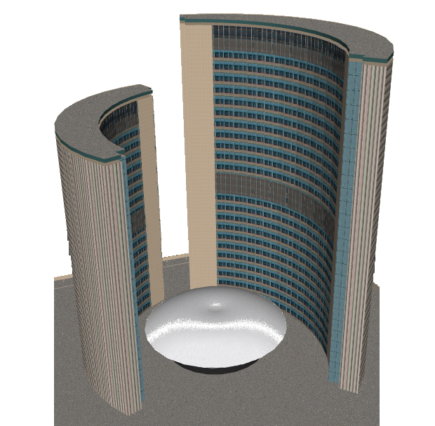

[[building_blocks]]
== JSON-FG building blocks

This Clause describes the JSON building blocks required to extend GeoJSON features and feature collections. The following clauses specify the formal requirements classes.

The Annex '<<considerations>>' contains considerations for some of the JSON-FG building blocks.

Remarks and known open issues are included in notes.

=== Overview

The following JSON building blocks are specified by this Standard:

* <<bb_core>>
** <<metadata>>
** <<time>>
** <<place>>
** <<ref-sys>>
* <<bb_3d>>
** <<polyhedron>>
** <<multi_polyhedron>>
** <<prism>>
** <<multi_prism>>
* <<bb_circular_arcs>>
** <<circular_string>>
** <<compound_curve>>
** <<curve_polygon>>
** <<multi_curve>>
** <<multi_surface>>
* <<bb_measures>>
** <<measures>>
* <<bb_feature_types_schemas>>
** <<feature-types>>
** <<schema-ref>>

An additional discussion topic during the development of the JSON-FG Standard was the relationship between a feature and other web resources that are represented as links. The JSON-FG Standard does not mandate a specific approach for representing relationships as links. However, Annex '<<relationships_and_links>>' documents and discusses patterns of how to represent relationships as links.

Annex '<<examples>>' has examples of JSON-FG objects.

[[general_approach]]
=== General Approach

The GeoJSON RFC clearly specifies in Clauses 6 and 7 that additional members can be added to the GeoJSON objects as long as they do not conflict with members as specified by GeoJSON ("foreign members").

JSON-FG extends GeoJSON in three ways:

* By adding new JSON members to the "Feature" and "FeatureCollection" objects;
* By specifying additional geometry objects.
* TODO: By specifying additional rules for the metrics.

As a result, JSON-FG does not place constraints on the information in the "properties" member (like GeoJSON) and JSON-FG readers do not have to parse the "properties" object. This approach avoids name clashes with existing feature properties in the "properties" object.

Some GeoJSON readers, however, only provide access to the pre-defined JSON members in GeoJSON features, such as "id", "geometry", "bbox" and "properties". If the target audience uses such tools, it is recommended to also include the additional top-level JSON-FG members like "time", "place", "featureType", "coordRefSys", and "measures" in the "properties" object.

[[bb_core]]
=== Core building blocks

[[metadata]]
==== Metadata: the "conformsTo" member

To indicate that a JSON document contains JSON-FG objects and to indicate the JSON-FG version and requirements classes implemented in the document, a `conformsTo` member is required to be included in the root object.

The value of the member is an array of strings, where each string is a URI of a conformance class.

[#ex-conformsTo-1,reftext='{listing-caption} {counter:listing-num}']
.Conformance declaration using URIs
====
[source,json,linenumbers]
----
"conformsTo" : [ 
  "http://www.opengis.net/spec/json-fg-1/0.3/conf/core", 
  "http://www.opengis.net/spec/json-fg-1/0.3/conf/3d" 
]
----
====

[[time]]
==== Temporal information: the "time" member

===== Overview

Many features have a geometry property that provides information about the primary spatial characteristics of the feature. In GeoJSON, this information is encoded in the "geometry" member. Features often have temporal information. In most cases, time is either an instant (e.g., an event) or an interval (e.g., an activity or a temporal validity). In the OGC API Features Standard the temporal property is reflected in the http://www.opengis.net/doc/IS/ogcapi-features-1/1.0#_parameter_datetime[parameter "datetime"] for temporal filtering of features that is supported by all compliant Feature API instances.

JSON-FG adds support for the most common case: Associating a feature with a single temporal instant or interval in the Gregorian calendar.

More complex cases and other temporal coordinate reference systems are out-of-scope for this Standard and might be specified in future extensions.

===== Description

Features can have temporal properties. These properties will typically be included in the "properties" member.

* In many datasets all temporal properties are instants (represented by a date or a timestamp) and intervals are described using two temporal instants, one for the start and one for the end.
* Multiple temporal properties are sometimes used to describe different temporal characteristics of a feature. For example, the time instant or interval when the information in the feature is valid (sometimes called "valid time") and the time when the feature was recorded in the dataset (sometimes called "transaction time"). Another example is the https://www.ogc.org/standards/om[Observations & Measurements Standard], where an observation has multiple temporal properties including "phenomenon time", "result time" and "valid time".

As GeoJSON does, JSON-FG does not place constraints on the information in the "properties" member. JSON-FG specifies a new JSON member in a feature object (key: "time"). The member describes temporal information (an instant or an interval) that can be used by clients without a need to inspect the "properties" member or to understand the schema of the feature. Clients that are familiar with a dataset can, of course, inspect the information in the "properties" member instead of inspecting the "time" member.

The publisher of the data needs to decide which temporal feature properties are used in the "time" member.

The "time" member is either missing or `null` (no temporal information) or an object with at least one member.

.Properties of the "time" object
[cols="20,10a,70a",options="header"]
!===
|Property |Type |Description
|date |string |An instant with a granularity of a date. See below for more details about instants.
|timestamp |string |An instant with the granularity of a timestamp. See below for more details about instants.
|interval |[ string ] |An interval, described by an array of the two instants (start and end). See below for more details about intervals.
!===

If both values intersect, then including both an instant and an interval is valid. In this case, clients should use the interval property and may use the date or timestamp property to determine the temporal characteristics of the feature.

The "time" object may be extended with additional members. Clients processing a "time" object must be prepared to parse additional members. Clients should ignore members that they do not understand. For example, in cases where the "time" member neither includes an "instant" or "interval", a client may process the feature as a feature without temporal information.

NOTE: The data publisher decides how temporal properties inside the "properties" member are encoded. The schema for the "time" member does not imply a recommendation that temporal feature properties reuse the same schema. For example, it is expected that a date-valued feature attribute will in most cases be represented as string with an RFC 3339 date value.

===== Instants

An instant is a value that conforms to https://datatracker.ietf.org/doc/html/rfc3339[RFC 3339 (Date and Time on the Internet: Timestamps)] and is consistent with one of the following production rules of the ISO 8601 profile specified in the RFC:

* `full-date` (e.g., `"1969-07-20"`)
* `date-time` (e.g., `"1969-07-20T20:17:40Z"`)

Conceptually, an instant is a "temporal entity with zero extent or duration" [<<owl-time,Time Ontology in OWL>>]. In practice, the temporal position of an instant is described using data types where each value has some duration or granularity. The value should be described with a granularity that is sufficient for the intended use of the data.

In the case of a timestamp the granularity is a second or smaller. All timestamps must be in the time zone UTC ("Z").

In the case of a date the granularity is a day. Dates as instants will be used when a granularity of a day independent of its timezone is sufficient for the intended use of the data. If that is not the case and the timezone is important for the intended use, the temporal information should be provided as an interval with start and end timestamps.

NOTE: The JSON-FG Standard only provides guidance as to how to represent feature data in JSON. Providing guidance as to how to cast JSON-FG data to other data types is out of scope. The https://docs.ogc.org/is/21-065r1/21-065r1.html[OGC Common Query Language (CQL2)] Standard uses the same model of instants and intervals as JSON-FG and includes additional guidance how to compare values.

[#ex-time-1,reftext='{listing-caption} {counter:listing-num}']
.A date
====
[source,json,linenumbers]
----
"time" : { "date": "1969-07-20" }
----
====

[#ex-time-2,reftext='{listing-caption} {counter:listing-num}']
.A timestamp
====
[source,json,linenumbers]
----
"time" : { "timestamp": "1969-07-20T20:17:40Z" }
----
====

Dates and timestamps are the initial range of instant values. The range may be extended in the future to support additional use cases. Clients processing values of `time` must be prepared to receive other values. Clients may ignore values that they do not understand.

===== Intervals

An interval is described by start and end instants. Both start and end instants are included in the interval, i.e., the interval is closed.

The unbounded end of an interval is represented by a double-dot string ("..") for the start/end. This follows the convention of ISO 8601-2 for an open start or end.

NOTE: There is a https://github.com/opengeospatial/ogc-feat-geo-json/issues/69[proposal] to use `null` instead of "..".

[#ex-time-3,reftext='{listing-caption} {counter:listing-num}']
.An interval with dates
====
[source,json,linenumbers]
----
"time" : { "interval": [ "1969-07-16", "1969-07-24" ] }
----
====

[#ex-time-4,reftext='{listing-caption} {counter:listing-num}']
.An interval with timestamps
====
[source,json,linenumbers]
----
"time" : { "interval": [ "1969-07-16T05:32:00Z", "1969-07-24T16:50:35Z" ] }
----
====

[#ex-time-5,reftext='{listing-caption} {counter:listing-num}']
.An half-bounded interval
====
[source,json,linenumbers]
----
"time" : { "interval": [ "2014-04-24T10:50:18Z", ".." ] }
----
====

The options described above are the initial range of interval values - the granularity is either days or (sub-)seconds and interval ends may be unbounded. The value range may be extended in the future to support additional use cases. Clients processing values of `time` must be prepared to receive other values. Clients may ignore values that they do not understand.

[[place]]
==== Geometry: the "geometry" and "place" members

===== Overview

Features typically have a geometry that provides information about the primary spatial characteristics of the feature.

In GeoJSON, geometry information is encoded in the "geometry" member. Geometries are encoded according to the <<ogc06_103r4,OGC Simple Features Standard>> (2D or 2.5D points, line strings, polygons or aggregations of them) using a WGS 84 CRS (OGC:CRS84 or OGC:CRS84h).

A key motivation for the development of the JSON-FG Standard is to support additional requirements, especially the ability to represent geometries in other CRSs and in additional geometry types.

To avoid confusing existing GeoJSON readers, such geometries are provided in a new member in the feature object with the key "place".

===== Description

The primary geometry of a feature is provided in the "geometry" and/or "place" members of the feature object as specified in the next sub-clause. The value of both members is an object representing a geometry - or `null`. The "place" member can also be omitted, if the member has no value.
 
The valid values of the "geometry" member are specified in the GeoJSON standard.

The value range of the "place" member is an extended and extensible version of the value range of the GeoJSON "geometry" member:

* Extended by additional geometry objects:
** Additional 3D geometry types <<Polyhedron>>, <<MultiPolyhedron>>, <<Prism>>, and <<MultiPrism>>;
** Additional geometry types supporting curves with circular arcs <<CircularString>>, <<CompoundCurve>>, <<CurvePolygon>>, <<MultiCurve>>, and <<MultiSurface>>;
* The capability to <<ref-sys,declare the coordinate reference system of the coordinates>>;
* The capability to <<measures,add a measure value to each coordinate>>.

Only the capability to declare the coordinate reference system is considered a Core capability. The other capabilities are added by additional building blocks described in subsequent sections.

Future parts of Features and Geometries JSON or community extensions may specify additional members or additional geometry types. JSON-FG readers should be prepared to parse values of "place" that go beyond the schema that is implemented by the reader. Unknown members should be ignored and geometries that use an unknown geometry type should be mapped to `null`.

NOTE: The JSON-FG standard does not add a new JSON-FG geometry collection that includes the new JSON-FG geometry types, because geometry collections are rarely used as feature geometries.

All coordinates in a "place" member are in the same coordinate reference system. This includes GeometryCollection geometries, where all geometries must be in the same coordinate reference system.

===== Use of "geometry" and/or "place"

If the geometry is a valid GeoJSON geometry (one of the GeoJSON geometry types, in WGS 84), the geometry is encoded as the value of the "geometry" member. The "place" member then has the value `null` or is omitted.

If the geometry cannot be represented as a valid GeoJSON geometry, the geometry is encoded as the value of the "place" member.  

In addition, a valid GeoJSON geometry may be provided as the value of the "geometry" member in the WGS 84 CRS as specified in the GeoJSON standard. Otherwise, the "geometry" member is set to `null`. If present, the geometry that is the value of the "geometry" member is a fallback for readers that support GeoJSON, but not JSON-FG. This fallback geometry could be a simplified version of the value of the "place" member - like the building footprint in the example <<example_building,"building with a polyhedron geometry and the polygon footprint">> which is the polygon projection of the solid geometry. The fallback geometry can also be the same point/line string/polygon geometry that is the value of the "place" member, but in a WGS 84 CRS (potentially with fewer vertices to reduce the file size). It is the decision of the publisher, how the fallback geometry in a WGS 84 CRS is derived from the geometry that is the value of the "place" member. In the example, this is the footprint of the building, but it also could be a representative point (to reduce the data volume) or a 3D MultiPolygon representing the outer shell of the polyhedron (for clients that support visualizations in 3D).

The presence of such fallback geometries in JSON-FG feature objects is indicated by a link from the JSON document to the "\http://www.opengis.net/def/profile/OGC/0/jsonfg-plus" profile (see <<rc_profiles>>).

NOTE: GeoJSON states that "geometry" is `null`, if the feature is "unlocated". A real-world entity is obviously not unlocated when "place" has a value. However, the GeoJSON representation of the feature can still considered to be "unlocated", if a representation in a WGS 84 CRS cannot be determined. Examples for such situations are: a local engineering CRS or a planetary CRS is used for the geometry in "place", or if the known consumers of the JSON document do not need the fallback geometry.

===== Metrics

TODO

If the CRS uses longitude and latitude as coordinates, clients should perform geometrical computations - including computation of length or area on the curved surface that approximates the earth's surface. Details are provided, for example, in the drafts of <<ogc20_070,Features and Geometry - Part 2: Metrics>>.

Note that this differs from GeoJSON which states:

[quote, GeoJSON (RFC 7946)]
A line between two positions is a straight Cartesian line, the shortest line between those two points in the coordinate reference system.
In other words, every point on a line that does not cross the antimeridian between a point (lon0, lat0) and (lon1, lat1) can be calculated as `F(lon, lat) = (lon0 + (lon1 - lon0) * t, lat0 + (lat1 - lat0) * t)` with t being a real number greater than or equal to 0 and smaller than or equal to 1. Note that this line may markedly differ from the geodesic path along the curved surface of the reference ellipsoid.

NOTE: Antimeridian: is the meridian 180° both east and west of the prime meridian in a geographical coordinate system. The longitude at this line can be given as either east or west.

[[ref-sys]]
==== Reference systems: the "coordRefSys" member

===== Overview

Without any other information, the following coordinate reference system (CRS) defaults apply in JSON-FG objects:

* Spatial CRS: WGS 84 with axis order longitude, latitude and optional ellipsoidal height, either "\http://www.opengis.net/def/crs/OGC/0/CRS84" (2D) or "\http://www.opengis.net/def/crs/OGC/0/CRS84h" (3D);
* Temporal CRS: DateTime in Gregorian calendar, "\http://www.opengis.net/def/crs/OGC/0/GregorianDateTime". 

NOTE: In the GregorianDateTime temporal CRS, all granularities of ISO 8601 are valid values according to https://docs.ogc.org/as/18-005r5/18-005r5.html#109[OGC Abstract Specification Topic 2: Referencing by coordinates, section D.3]. That is, both dates and timestamps are valid values in the CRS.

In this JSON-FG Standard, a new key "coordRefSys" is defined and can be used to assert the CRS of a JSON-FG geometry object at the collection, feature, or value levels.

The "coordRefSys" key _**does not**_ apply to the GeoJSON `geometry` member. This key only applies to geometry objects in the "place" member and those that may appear in the "properties" member.

If a CRS is asserted for a JSON-FG object, that assertion will typically be made at the root level of JSON-FG objects, either at the feature collection level or the feature level depending on the document contents.

===== Description

Spatio-temporal objects are specified relative to some reference system.

GeoJSON (both the current <<rfc7946,RFC>> and the https://geojson.org/geojson-spec.html[legacy version]) fixed the reference system for geometric values to the "WGS84 datum, and with [an axis order of] longitude and latitude [and coordinate] units of decimal degrees".  The https://geojson.org/geojson-spec.html[legacy version] included a "prior arrangement" provision to allow other reference systems to be used and to also defined the "crs" key for specifying the reference system.  This _prior arrangement_ mechanism survived into the https://tools.ietf.org/html/rfc7946[RFC] but the accompanying "crs" key did not. The result is that there is no interoperable way to unambiguously specify a different CRS in GeoJSON.  As such, the only safe approach is to continue using OGC:CRS84(h) for GeoJSON and ignore the _prior arrangement_ provision and the old "crs" key.

Additional JSON-FG building blocks like the "place" member are not bound by these restrictions and so this Standard provides for handling reference systems in JSON-FG objects in a way that does not interfere with anything, past or present, defined in any of the GeoJSON specifications. The GeoJSON building blocks can continue to operate as always but JSON-FG building blocks provides enhanced CRS support.

===== Reference system values

A reference system can be specified in a JSON-FG object using a "coordRefSys" member in one of three ways:

* As a CRS reference using the URI of a simple CRS;
* As a CRS reference using the URI of a simple CRS accompanied by an optional epoch value (for https://docs.ogc.org/as/18-005r5/18-005r5.html#64[dynamic CRSs]);
* As an array of simple CRS references denoting an ad hoc compound reference system.

[#rs-by-simple-ref,reftext='{listing-caption} {counter:listing-num}']
.A simple reference system value by reference (URI).
====
[source,json,linenumbers]
----
"http://www.opengis.net/def/crs/EPSG/0/3857"
----
====

[#rs-by-ref-with-epoch,reftext='{listing-caption} {counter:listing-num}']
.A reference system value by reference (URI) and with an epoch.
====
The epoch is the point in time, expressed as a decimal year, to which coordinates in a dynamic coordinate reference system are referenced. The epoch 2017.23 is March 25, 2017 in the Gregorian calendar.

[source,json,linenumbers]
----
{
  "type": "Reference",  
  "href": "http://www.opengis.net/def/crs/EPSG/0/4979",
  "epoch": 2017.23
}
----
====

[#compound-rs-by-value,reftext='{listing-caption} {counter:listing-num}']
.A ad hoc compound reference system value (using URIs)
====
[source,json,linenumbers]
----
[
  {
    "type": "Reference",  
    "href": "http://www.opengis.net/def/crs/EPSG/0/4258",
    "epoch": 2016.47
  },
  "http://www.opengis.net/def/crs/EPSG/0/7837"
]
----
====

===== The "crs" member

TODO

[[ref-sys-scoping-rules]]
===== Scoping rules

Used at the feature collection level, the "coordRefSys" key asserts the CRS for JSON-FG geometry objects found anywhere in the feature collection that are not otherwise tagged with CRS information in the feature or geometry object.

Used at the feature level, the "coordRefSys" key asserts the CRS for JSON-FG geometry objects found anywhere in the feature that are not otherwise tagged with CRS information in the geometry object.

Used at the geometry level, the "coordRefSys" key asserts the CRS for the JSON-FG geometry object within which the key is contained. For a GeometryCollection, all geometries in the collection must be in the same CRS (this constraint is "inherited" from the <<ogc06_103r4,OGC Simple Feature Access Standard>>) and cannot include a "coordRefSys" member.

Where all objects on the same level are in the same CRS, declaring the CRS on the parent level instead of declaring it in all parallel objects is recommended.

===== Coordinate order

The order in which coordinates for JSON-FG geometry objects are expressed is defined in the https://portal.opengeospatial.org/files/?artifact_id=76024[OGC Axis Order Policy] and shall be in the axis order defined by the closest-to-scope CRS metadata.

===== Additional coordinate reference systems

For unknown coordinate reference systems, such as with CAD engineering drawings, the following CRS identifiers can be used:

* https://www.opengis.net/def/crs/OGC/0/Engineering2D[`OGC:Engineering2D`] for 2D coordinates (x, y);
* https://www.opengis.net/def/crs/OGC/0/Engineering3D[`OGC:Engineering3D`] for 3D coordinates (x, y, z).

[[bb_3d]]
=== Building blocks for 3D geometries

NOTE: There is an https://github.com/opengeospatial/ogc-feat-geo-json/issues/88[ongoing discussion] about which 3D geometries should be included in JSON-FG and how they should be grouped into conformance classes. This discussion has to be resolved and this note must be removed before finalizing the JSON-FG Standard.

[[polyhedron]]
==== Polyhedron

A solid is defined by its bounding surfaces. Each bounding surface is a closed, simple surface, also called a shell. 

Each solid has a unique exterior shell and any number of shells that are inside the exterior shell and that describe voids. The interior shells do not intersect each other and cannot contain another interior shell.

A _polyhedron_ is a solid where each shell is a multi-polygon. 'Closed' means that the multi-polygon shell is watertight, it splits space into two distinct regions: inside and outside of the shell. 'Simple' means that the polygons that make up the shell do not intersect, they only touch each other along their common boundaries.

[#figurePolyhedra]
.A Polyhedron (Cologne Cathedral).

TODO: all faces of the polyhedron should be rendered the same way (no red roofs).

The JSON representation of the coordinates of a polyhedron is a non-empty array of _multi-polygon_ arrays. Each _multi-polygon_ array is a shell. The first shell is the exterior boundary, all other shells are voids.

NOTE: As in a GeoJSON Polygon, the first and last positions of each ring have identical values.

The dimension of all positions is three.

The Cologne Cathedral with polyhedron geometries is provided as an example in <<example_cc,Annex C>>.

[[multi_polyhedron]]
==== MultiPolyhedron

A _multi-polyhedron_ is a collection of _polyhedron_ objects. These are arbitrary aggregations. There is no assumption regarding the topological relationships between the _polyhedron_ objects, but in most cases the _polyhedron_ objects will not intersect each other. 

NOTE: According to ISO 19107:2020 ("Spatial schema"), the geometry of the _multi-polyhedron_ is the set theoretic union of all _polyhedron_ objects. For example, if there are overlapping _polyhedron_ objects, the volume of the _multi-polyhedron_ will be smaller than the sum of the _polyhedron_ volumes.

The collection of polyhedron objects is represented as a JSON array. The order of the polyhedron objects in the array is not significant.

[[prism]]
==== Prism

A _prism_ is defined by a base shape (e.g. Polygon or Circle) that is then extruded from some optional lower limit to an upper limit.

The limits are measured relative to a specified 3D CRS. That is either the default 3D CRS (OGC:CRS84h) or another 3D CRS specified using the <<ref-sys,coordRefSys>> key.

If the base shape is a point, then the extrusion is a line extending from the lower limit to the upper limit.

A pylon feature with a base shape of a point is provided as an example in <<example_pylon,Annex C>>.

If the base shape is a line string, then the extrusion is a ribbon following the path of the line string and extending from the lower limit to the upper limit.

A fence feature with a base shape of a line string is provided as an example in <<example_fence,Annex C>>.

If the base shape is a polygon, then the extrusion is a solid whose footprint takes the shape of the specified polygon and extended from the lower limit to the upper limit. If the polygon base shape contains holes, these manifest as voids in the extruded shape.

[#figurePolygonExtrusion]
.Extruded polygons (building footprints extruded with the height of the building, City of Cologne/Germany).

[[multi_prism]]
==== MultiPrism

A _multi-prism_ is an array of _prism_ objects.  The order of the prism geometry objects in the array is not significant.

The following figure shows a 3D rendering of Toronto City Hall. The feature with a MultiPrism geometry is provided as an example in <<example_tch,Annex C>>.

[#figurePolygonExtrusionTorontoCityHall]
.Toronto City Hall

[[bb_circular_arcs]]
=== Building blocks for circular arcs

All examples in this section use RD new (`http://www.opengis.net/def/crs/EPSG/0/28992`) as the coordinate reference system.

[[circular_string]]
==== CircularString

A _circular string_ is defined by a sequence of an odd number of positions with a minimum of three positions. For each set of three consecutive positions, the geometry is a circular arc passing from the first position through the middle position to the third position.

To support validation of the odd number of positions, a maximum number of 11 positions are allowed in a circular string (that is, a maximum number of five circular arcs in a circular string).

[#circular-arc,reftext='{listing-caption} {counter:listing-num}']
.A circular arc
====
[source,json,linenumbers]
----
include::examples/arc.json[]
----
====

A circle is a circular string with five positions where the first and last positions have identical values and both arcs have the same radius.

[#circle,reftext='{listing-caption} {counter:listing-num}']
.A circle
====
[source,json,linenumbers]
----
include::examples/circle.json[]
----
====

[[compound_curve]]
==== CompoundCurve

A _compound curve_ is a sequence of curves that are connected end-to-end. The curves can be _line string_ or _circular string_ objects. The end of one curve is the start of the next curve.

[#compound-curve,reftext='{listing-caption} {counter:listing-num}']
.A compound curve with two line strings and two arcs
====
[source,json,linenumbers]
----
include::examples/compound-curve.json[]
----
====

[[curve_polygon]]
==== CurvePolygon

A _curve polygon_ is a surface where each ring is a closed _line string_, _circular string_, or _compound curve_. The first ring is the exterior boundary, all other rings are interior boundaries.

[#curve-polygon,reftext='{listing-caption} {counter:listing-num}']
.A curve polygon with three holes
====
[source,json,linenumbers]
----
include::examples/curve-polygon.json[]
----
====

[[multi_curve]]
==== MultiCurve

A _multi-curve_ is a set of curves (_line string_, _circular string_ or _compound curve_ objects). There is no assumption regarding the topological relationships between the curves.

[#multi-curve,reftext='{listing-caption} {counter:listing-num}']
.A multi-curve
====
[source,json,linenumbers]
----
include::examples/multi-curve.json[]
----
====

[[multi_surface]]
==== MultiSurface

A _multi-surface_ is a set of surfaces (_polygon_ or _curve polygon_ objects). There is no assumption regarding the topological relationships between the surfaces.

[#multi-surface,reftext='{listing-caption} {counter:listing-num}']
.A multi-surface
====
[source,json,linenumbers]
----
include::examples/multi-surface.json[]
----
====

[[bb_measures]]
=== Building blocks for measures

In most cases, geometries are restricted to coordinates according to <<ref-sys>>. 

The <<ogc06_103r4,OGC Simple Feature Access Standard>> also supports an additional measure value for each coordinate (M coordinate). 

A typical use case are linear referencing, where the measure value in a curve is the distance of each position along the geometry from the start of the geometry to the position. 

[[measures]]
==== Measures: the "measures" member

If a geometry includes measure values, each position of the geometry has to contain a measure value. The number of ordinates in each position is the dimension of the CRS in "coordRefSys" plus one for the measure value.

The presence of measure values in a geometry is indicated by a "measures" member.

The value of the "measures" member is an object with the following properties:

* "enabled": A boolean value. If `true`, the measure values are enabled. If `false`, the measure values are disabled. The property is required.
* "unit": The unit of the measure of the measure values. The property is optional.
* "description": An optional description of the meaning of the measure values.

The scoping rules are the same as for the <<ref-sys-scoping-rules,"coordRefSys" member>>.

Annex C includes <<example_road_segment,an example of a road element feature with measure values>>.

[[bb_feature_types_schemas]]
=== Building blocks for feature types and schemas

[[feature-types]]
==== Feature types: the "featureType" member

===== Overview

Features are often categorized by type. Typically, all features of the same type have the same schema and the same properties.

Many GIS clients depend on knowledge about the feature type when processing feature data. For example, when associating a style with a feature in order to render that feature on a map display.

GeoJSON is schema-less in the sense that it has no concept of feature types or feature schemas.

In most cases, a feature is an instance of a single feature type, but in general, features can be instances of multiple types. JSON-FG also supports multiple feature types.

The related section <<schema-ref>> specifies the schema for each feature type if such information is available.

===== The "featureType" member

The feature types of a feature are declared in a member of the feature object with the key "featureType". The value is either a string (in the standard case of a single feature type) or an array of strings (to support features that instantiate multiple feature types). Each string should be a code, convenient for the use in filter expressions.

Data specifications often specify codes for feature types. Where data is based on such a data specification, those code will in general be used. An example is the https://portal.dgiwg.org/files/3911[DIGEST 2.1 Feature and Attribute Coding Catalogue (FACC) Data Dictionary] of the https://dgiwg.org/[Defence Geospatial Information Working Group (DGIWG)].

NOTE: A feature type that "just" identifies a concept, but has no associated or no well-defined schema, will not include a schema reference in the "featureSchema" member (see below) for the feature type.

NOTE: The https://www.iana.org/assignments/link-relations/link-relations.xml[IANA link relations] include a link relation "type" which can, in addition, be used to reference a resource that describes a feature type beyond the code in the "featureType" member. 

[[homogeneous-collections]]
===== Homogeneous feature collections

Some clients will process feature collections differently depending on whether the collection is homogeneous with respect to the feature type or the geometry type. These clients will benefit from information that declares the feature and/or geometry type for all features in a collection.

For a feature collection where all features have the same "featureType" value, the "featureType" member can and should be added once for the feature collection. The "featureType" member can then be omitted in the feature objects. Declaring the feature type(s) once signals to clients that the feature collection is homogeneous with respect to the type, which clients can use to optimize their processing.

For a feature collection where all features in the feature collection have the same geometry type as their primary geometry (point, curve, surface, solid, including homogeneous aggregates), a "geometryDimension" member can and should be added once for the feature collection with the dimension of the geometry (0 for points, 1 for curves, 2 for surfaces, 3 for solids, null/not set for mixed dimensions or unknown). Declaring the geometry dimension once signals to clients that the feature collection is homogeneous with respect to the dimension, which clients can use to optimize their processing.

[[schema-ref]]
==== Feature schemas: the "featureSchema" member

===== Overview

A JSON-FG feature schema is metadata about a feature that clients can use to understand the content of JSON-FG feature objects, such as a textual description of the feature properties or their value range. 

JSON-FG follows the approach of <<OAFeat-5,OGC API - Features - Part 5>>, that is, the feature schema is a logical schema. It can not be used to directly validate a JSON document. However, a schema for validation of a JSON-FG feature or feature collection can be derived from the logical schema, if needed. The schemas of the feature properties in the logical schemas can be reused when constructing a JSON Schema for validation.

This Standard provides guidance on how to include information about the feature schemas in a JSON-FG feature or feature collection.

===== The "featureSchema" member

If all features in the JSON document have the same feature schema (either a single feature or a homogeneous feature collection), the URI of the feature schema can and should be provided in a top-level JSON member "featureSchema" with the feature schema URI as the value.

[source,json]
----
{
  "type": "FeatureCollection",
  "featureType": "Airport",
  "featureSchema": "https://demo.ldproxy.net/zoomstack/collections/airports/schema",
  "geometryDimension": 0,
  "conformsTo": [ "http://www.opengis.net/spec/json-fg-1/0.3/conf/core", "http://www.opengis.net/spec/json-fg-1/0.3/conf/types-schemas" ],
  "features": [ ... ]
}
----

If the features in the JSON document reference multiple feature types, the value of "featureSchema" is an object, where each key is the feature type that the schema describes.

[source,json]
----
{
  "type": "FeatureCollection",
  "featureSchema": {
    "Airport": "https://demo.ldproxy.net/zoomstack/collections/airports/schema",
    "RailwayStation": "https://demo.ldproxy.net/zoomstack/collections/railway_stations/schema"
  },
  "conformsTo": [ "http://www.opengis.net/spec/json-fg-1/0.3/conf/core", "http://www.opengis.net/spec/json-fg-1/0.3/conf/types-schemas" ],
  "features": [ ... ]
}
----

===== Referencing schema for JSON Schema validation

The <<json-schema,JSON Schema specification>> recommends using https://json-schema.org/draft/2020-12/json-schema-core.html#rfc.section.9.5[a "describedby" link relation to a schema] that can be used to validate a JSON document:

[quote, JSON Schema]
RECOMMENDATION: Instances described by a schema provide a link to a downloadable JSON Schema using the link relation "describedby" [...].

Where JSON Schema validation is important, such links can be added. For example, OGC API Features already specifies a general "links" member with an array of link objects based on https://tools.ietf.org/html/rfc8288[RFC 8288 (Web linking)] and feature responses from APIs implementing OGC API Features will already include a "links" member.

[[profiles]]
==== GeoJSON Profiles

TODO